#Proc-play

Procedural generation playground. This repo was literally a playground for me to learn some cool stuff.

Procedural generation of maps, textures, particle effects, and apparantly noses.

Uses noise functions (especially Perlin noise), Cellular Automata, Graph traverals (Random BFS) and L-Systems (A little).
Also uses upscaling, which doesn't really have a name I guess. Maybe I invented it.

[See it in action](http://luca-spopo.github.io/proc-play/)

Want a peek?

Level generation:

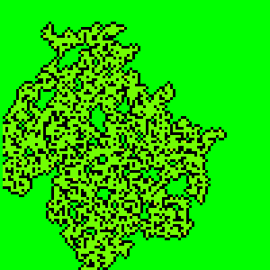
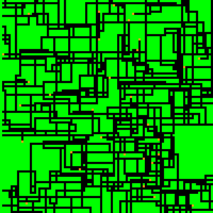
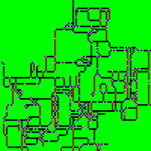
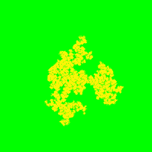
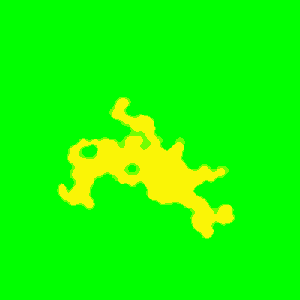
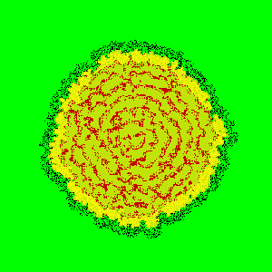
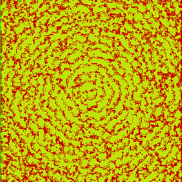

Textures:

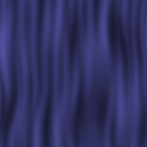
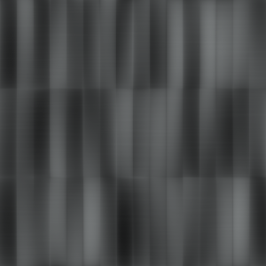

Area Transitions:

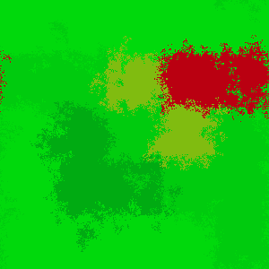
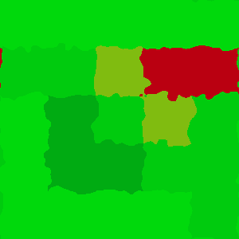
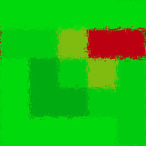

Particle Effects:

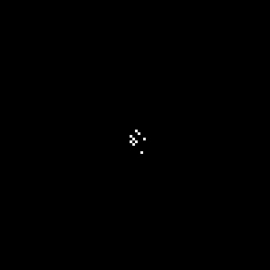
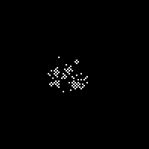
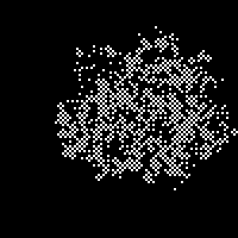

Plain old Perlin noise:

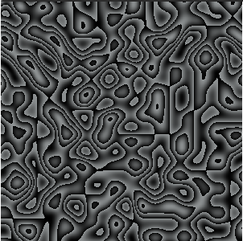

Golem sprites:

